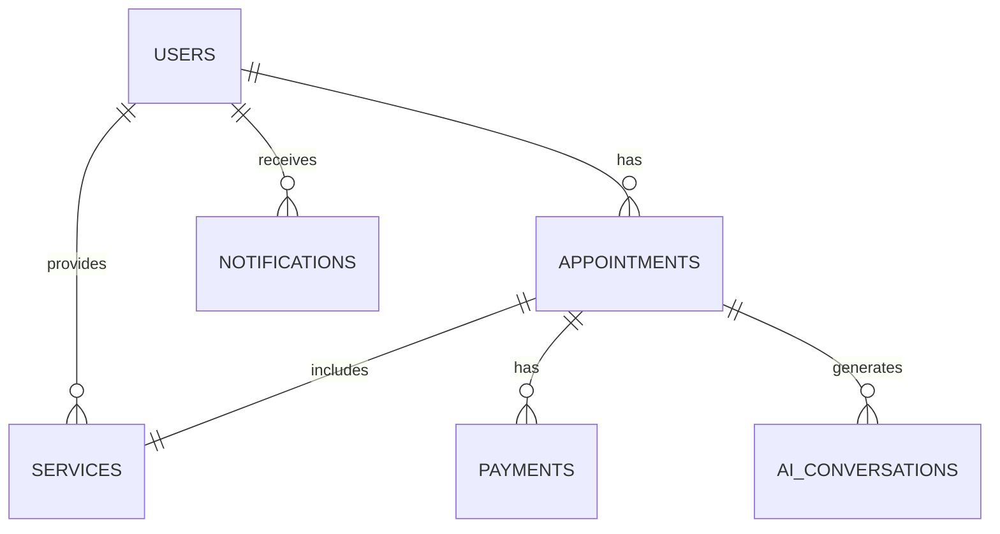

# 📁 Proje Yapısı

```
randevu-sistemi/
├── 📁 backend/                    # Backend API
│   ├── 📁 src/
│   │   ├── 📁 controllers/        # Route controllers
│   │   ├── 📁 models/            # Database models
│   │   ├── 📁 routes/            # API routes
│   │   ├── 📁 middleware/        # Custom middleware
│   │   ├── 📁 services/          # Business logic
│   │   ├── 📁 utils/             # Utility functions
│   │   ├── 📁 config/            # Configuration files
│   │   └── 📁 types/             # TypeScript type definitions
│   ├── 📄 package.json
│   ├── 📄 tsconfig.json
│   └── 📄 .env
│
├── 📁 frontend/                   # Frontend React App
│   ├── 📁 src/
│   │   ├── 📁 components/        # Reusable components
│   │   ├── 📁 pages/             # Page components
│   │   ├── 📁 hooks/             # Custom hooks
│   │   ├── 📁 services/          # API services
│   │   ├── 📁 utils/             # Utility functions
│   │   ├── 📁 types/             # TypeScript types
│   │   ├── 📁 styles/            # CSS/SCSS files
│   │   └── 📁 assets/            # Images, icons, etc.
│   ├── 📄 package.json
│   ├── 📄 tailwind.config.js
│   └── 📄 next.config.js
│
├── 📁 database/                   # Database scripts
│   ├── 📄 schema.sql             # Database schema
│   ├── 📄 migrations/            # Database migrations
│   └── 📄 seeds/                 # Sample data
│
├── 📁 docs/                       # Documentation
│   ├── 📄 api-docs.md            # API documentation
│   ├── 📄 deployment.md          # Deployment guide
│   └── 📄 ai-integration.md      # AI integration guide
│
├── 📁 docker/                     # Docker configuration
│   ├── 📄 docker-compose.yml
│   ├── 📄 Dockerfile.backend
│   └── 📄 Dockerfile.frontend
│
└── 📄 README.md                   # Project documentation
```

## 🗂️ Klasör Detayları

### Backend Klasörleri

#### `controllers/`

- `authController.ts` - Kimlik doğrulama işlemleri
- `appointmentController.ts` - Randevu işlemleri
- `userController.ts` - Kullanıcı işlemleri
- `aiController.ts` - AI entegrasyonu
- `paymentController.ts` - Ödeme işlemleri

#### `models/`

- `User.ts` - Kullanıcı modeli
- `Appointment.ts` - Randevu modeli
- `Service.ts` - Hizmet modeli
- `Payment.ts` - Ödeme modeli

#### `services/`

- `aiService.ts` - AI servis entegrasyonu
- `emailService.ts` - Email gönderimi
- `smsService.ts` - SMS gönderimi
- `calendarService.ts` - Takvim entegrasyonu
- `paymentService.ts` - Ödeme işlemleri

#### `middleware/`

- `auth.ts` - Kimlik doğrulama middleware
- `validation.ts` - Veri doğrulama
- `errorHandler.ts` - Hata yönetimi
- `rateLimiter.ts` - Rate limiting

### Frontend Klasörleri

#### `components/`

- `ui/` - Temel UI bileşenleri
- `forms/` - Form bileşenleri
- `calendar/` - Takvim bileşenleri
- `chat/` - Chatbot bileşenleri
- `dashboard/` - Dashboard bileşenleri

#### `pages/`

- `auth/` - Giriş/kayıt sayfaları
- `dashboard/` - Dashboard sayfaları
- `appointments/` - Randevu sayfaları
- `profile/` - Profil sayfaları

#### `hooks/`

- `useAuth.ts` - Kimlik doğrulama hook'u
- `useAppointments.ts` - Randevu hook'u
- `useAI.ts` - AI hook'u
- `useNotifications.ts` - Bildirim hook'u

## 🔧 Konfigürasyon Dosyaları

### Backend

- `package.json` - Bağımlılıklar ve scriptler
- `tsconfig.json` - TypeScript konfigürasyonu
- `.env` - Ortam değişkenleri
- `jest.config.js` - Test konfigürasyonu

### Frontend

- `package.json` - Bağımlılıklar ve scriptler
- `tailwind.config.js` - Tailwind CSS konfigürasyonu
- `next.config.js` - Next.js konfigürasyonu
- `.env.local` - Ortam değişkenleri

## 🐳 Docker Yapısı

### `docker-compose.yml`

```yaml
version: "3.8"
services:
  backend:
    build: ./backend
    ports:
      - "3001:3001"
    environment:
      - DATABASE_URL=postgresql://postgres:password@db:5432/appointment_system
    depends_on:
      - db
      - redis

  frontend:
    build: ./frontend
    ports:
      - "3000:3000"
    depends_on:
      - backend

  db:
    image: postgres:14
    environment:
      POSTGRES_DB: appointment_system
      POSTGRES_USER: postgres
      POSTGRES_PASSWORD: password
    volumes:
      - postgres_data:/var/lib/postgresql/data

  redis:
    image: redis:6-alpine
    ports:
      - "6379:6379"
```

## 📊 Veritabanı İlişkileri



## 🚀 Deployment Yapısı

### Production

- **Backend**: Vercel/Heroku/AWS
- **Frontend**: Vercel/Netlify
- **Database**: AWS RDS/Google Cloud SQL
- **Redis**: AWS ElastiCache/Redis Cloud

### Development

- **Local**: Docker Compose
- **Staging**: Docker Swarm/Kubernetes
